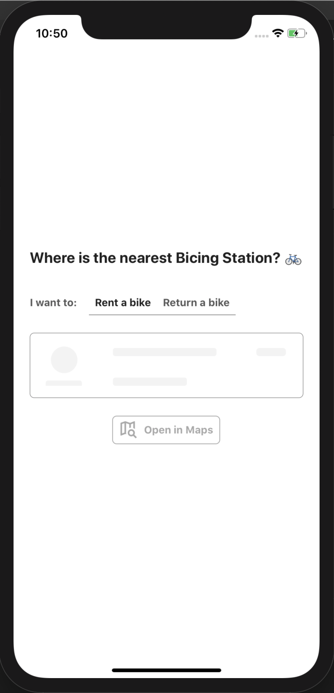
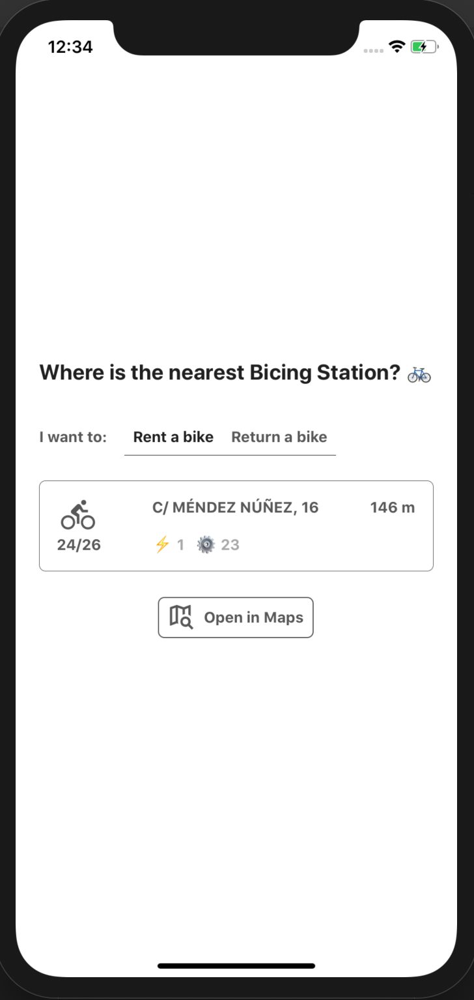

# Bicing Nearest Station App 🚴

[Link here](https://expo.io/@yorkeutopy/bicing-nearest-station-app)

Mobile App written in **React Native + Typescript** powered by **Expo** that tells you information about the nearest Bicing station.

**... But why?**

Well, because I took way too much time opening the Bicing App, looking at where the nearest station was, and getting the directions to it in Google Maps 📍 while being on a rush and/or with the bike.

You can choose whether you are **returning or renting** a bike so it filters out the stations that do not have bikes or spaces available.

You can also open in Google Maps the directions to get to the bicing station, easy right? 💪

## Develop

- run `npm start` to open the **Expo** bundle
- run `npm test` to run the tests (87% of coverage)

## How does it look like? ✨

It's pretty basic, just as it's purpose.

  
  

